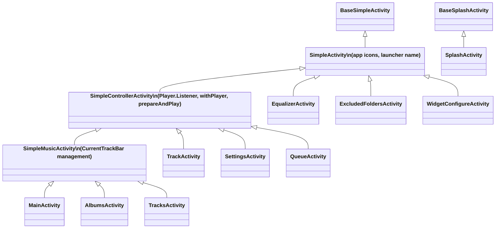

# Compose Migration Architecture — Fossify Music Player

## 1. Current Codebase Analysis

### 1.1 Activity Hierarchy



### 1.2 Screens Inventory

| Screen | Base Class | UI System | Has CurrentTrackBar | Complexity |
|--------|-----------|-----------|--------------------|-----------:|
| **TrackActivity** | `SimpleControllerActivity` | ✅ **Compose** | No | High |
| **MainActivity** | `SimpleMusicActivity` | XML + ViewPager + Fragments | Yes | Very High |
| **TracksActivity** | `SimpleMusicActivity` | XML + RecyclerView adapters | Yes | High |
| **AlbumsActivity** | `SimpleMusicActivity` | XML + RecyclerView adapters | Yes | Medium |
| **QueueActivity** | `SimpleControllerActivity` | XML + RecyclerView + drag | No | Medium |
| **SettingsActivity** | `SimpleControllerActivity` | XML + manual binding | No | Medium |
| **EqualizerActivity** | `SimpleActivity` | XML + SeekBars | No | Medium |
| **ExcludedFoldersActivity** | `SimpleActivity` | XML + RecyclerView | No | Low |
| **WidgetConfigureActivity** | `SimpleActivity` | XML (widget preview) | No | Low |
| **SplashActivity** | `BaseSplashActivity` | None (redirect) | No | Trivial |

### 1.3 Fragments (Not Android Fragments — Custom Views!)

> [!IMPORTANT]
> The "fragments" in this project are **not** `androidx.fragment.app.Fragment`. They are custom `RelativeLayout` subclasses inflated as ViewPager pages. This is actually *easier* to migrate — they can become plain `@Composable` functions directly.

| Fragment (View) | Data Type | Adapter |
|-----------------|-----------|---------|
| `TracksFragment` | `Track` | `TracksAdapter` |
| `AlbumsFragment` | `Album` | `AlbumsAdapter` |
| `ArtistsFragment` | `Artist` | `ArtistsAdapter` |
| `FoldersFragment` | `Folder` | `FoldersAdapter` |
| `GenresFragment` | `Genre` | `GenresAdapter` |
| `PlaylistsFragment` | `Playlist` | `PlaylistsAdapter` |

All follow the same pattern: load data → show in RecyclerView with fast scroller → support search/sort/action mode.

### 1.4 Key Observations

1. **`withPlayer {}`** — The core player interaction API. Every screen that controls playback inherits from `SimpleControllerActivity` and uses `withPlayer { ... }` to safely invoke `MediaController` methods.

2. **EventBus** — Used for cross-component communication (`PlaylistsUpdated`, `RefreshTracks`, `RefreshFragments`, `SleepTimerChanged`).

3. **Fossify Commons** — External library providing `BaseSimpleActivity`, edge-to-edge setup, color management, toolbar setup, dialogs, etc. We **cannot modify** this library, so our Compose layer must bridge to it.

4. **`CurrentTrackBar`** — A custom XML view shown at the bottom of list screens. Must be converted to a Composable.

5. **RecyclerView + Action Mode CAB** — All list adapters inherit from `BaseMusicAdapter` which provides multi-select CAB (Contextual Action Bar). This is the hardest piece to replicate in Compose.

---

## 2. The Core Question: Do We Need 3 Files Per Screen?

**No.** The 3-file pattern (`Activity` + `Screen` + `UiState`) was correct for `TrackActivity` because it has **complex, time-varying state** (progress bar, play/pause, shuffle, repeat, cover art, next track). But a screen like `ExcludedFoldersActivity` or `SettingsActivity` doesn't need a separate `UiState` data class — the state is simple enough to live inline.

### Recommended file count by complexity:

| Complexity | Files | Example |
|-----------|-------|---------|
| **Trivial** | 1 file — Activity with inline `setContent { }` | `SplashActivity` |
| **Simple** | 1-2 files — Activity + Screen composable in same file, or Screen in separate file | `ExcludedFoldersActivity`, `SettingsActivity` |
| **Medium** | 2 files — Activity + Screen (UiState as a data class inside the Screen file) | `QueueActivity`, `EqualizerActivity` |
| **Complex** | 2-3 files — Activity + Screen + UiState (separate file when state is large) | `TrackActivity`, `MainActivity` |

> [!TIP]
> **Rule of thumb:** If the `UiState` data class has ≤ 5 fields, keep it in the Screen file. If it has > 5 fields or is shared across multiple composables, give it its own file.

---

## 3. Proposed Package Structure

```
org.fossify.musicplayer/
├── App.kt
│
├── ui/                              ← NEW: All Compose UI code
│   ├── theme/
│   │   ├── FossifyTheme.kt          ← Material3 theme bridging Fossify Commons colors
│   │   ├── Color.kt                 ← Shared color constants (White70, Scrim, etc.)
│   │   └── Typography.kt            ← Shared text styles
│   │
│   ├── components/                   ← Shared reusable composables
│   │   ├── CurrentTrackBar.kt        ← Compose version of CurrentTrackBar
│   │   ├── MusicList.kt              ← Generic list with fast-scroll, placeholder, search
│   │   ├── TopAppBar.kt              ← Compose version of setupTopAppBar
│   │   ├── ActionModeBar.kt          ← Compose replacement for CAB multi-select
│   │   ├── LottiePlayPause.kt        ← Extracted from TrackScreen (reusable)
│   │   └── CoverArtImage.kt          ← Glide-backed cover art composable
│   │
│   ├── track/                        ← Feature: Now Playing
│   │   ├── TrackActivity.kt
│   │   ├── TrackScreen.kt
│   │   └── TrackUiState.kt
│   │
│   ├── main/                         ← Feature: Main tabbed screen
│   │   ├── MainActivity.kt
│   │   ├── MainScreen.kt             ← Pager + tabs + sleep timer
│   │   ├── MainUiState.kt
│   │   └── tabs/
│   │       ├── TracksTab.kt           ← Replaces TracksFragment
│   │       ├── AlbumsTab.kt           ← Replaces AlbumsFragment
│   │       ├── ArtistsTab.kt
│   │       ├── FoldersTab.kt
│   │       ├── GenresTab.kt
│   │       └── PlaylistsTab.kt
│   │
│   ├── queue/                         ← Feature: Queue
│   │   ├── QueueActivity.kt
│   │   └── QueueScreen.kt            ← UiState inline (small state)
│   │
│   ├── settings/                      ← Feature: Settings
│   │   ├── SettingsActivity.kt
│   │   └── SettingsScreen.kt
│   │
│   ├── equalizer/                     ← Feature: Equalizer
│   │   ├── EqualizerActivity.kt
│   │   └── EqualizerScreen.kt
│   │
│   ├── albums/                        ← Feature: Artist → Albums drill-down
│   │   ├── AlbumsActivity.kt
│   │   └── AlbumsScreen.kt
│   │
│   ├── tracks/                        ← Feature: Album/Playlist/Folder → Tracks
│   │   ├── TracksActivity.kt
│   │   └── TracksScreen.kt
│   │
│   ├── excludedfolders/
│   │   ├── ExcludedFoldersActivity.kt
│   │   └── ExcludedFoldersScreen.kt
│   │
│   └── widget/
│       └── WidgetConfigureActivity.kt ← Keep XML (AppWidget preview requires it)
│
├── activities/                        ← Base activity classes (keep here)
│   ├── SimpleActivity.kt
│   ├── SimpleControllerActivity.kt
│   ├── SimpleMusicActivity.kt         ← Refactored: Compose-friendly
│   └── SplashActivity.kt
│
├── playback/                          ← Unchanged
├── models/                            ← Unchanged
├── helpers/                           ← Unchanged
├── interfaces/                        ← Unchanged
├── extensions/                        ← Unchanged
├── objects/                           ← Unchanged
│
├── adapters/                          ← Gradually emptied as Compose replaces lists
│   └── ...
├── fragments/                         ← Gradually emptied as tabs become composables
│   └── ...
└── views/                             ← Gradually emptied
    └── ...
```

> [!NOTE]
> The `adapters/`, `fragments/`, and `views/` packages will shrink to zero as migration progresses. They stay around during the transition so old and new code coexist.

---

## 4. Shared Infrastructure (Build First)

### 4.1 `FossifyTheme.kt` — Bridge Fossify Commons Colors to Compose

```kotlin
// ui/theme/FossifyTheme.kt
@Composable
fun FossifyTheme(
    activity: BaseSimpleActivity,
    content: @Composable () -> Unit,
) {
    val textColor = Color(activity.getProperTextColor())
    val primaryColor = Color(activity.getProperPrimaryColor())
    val backgroundColor = Color(activity.getProperBackgroundColor())

    val colorScheme = darkColorScheme(
        primary = primaryColor,
        onPrimary = Color(primaryColor.toArgb().getContrastColor()),
        background = backgroundColor,
        onBackground = textColor,
        surface = backgroundColor,
        onSurface = textColor,
    )

    MaterialTheme(
        colorScheme = colorScheme,
        content = content,
    )
}
```

This lets every Compose screen use `MaterialTheme.colorScheme.primary` etc., and it always matches the user's chosen Fossify theme.

### 4.2 `ComposeControllerActivity` — New Base for Compose Screens

```kotlin
// activities/SimpleControllerActivity.kt (add to existing)
// OR a new base:

abstract class ComposeControllerActivity : SimpleControllerActivity() {
    /**
     * Subclasses call this in onCreate() to set Compose content
     * with the Fossify theme pre-applied.
     */
    protected fun setComposeContent(content: @Composable () -> Unit) {
        setContent {
            FossifyTheme(activity = this) {
                content()
            }
        }
    }
}
```

> [!TIP]
> You don't *need* a new class — you could also just add `setComposeContent` as a method on `SimpleControllerActivity` directly. The existing `setContentView(binding.root)` calls in XML-based activities will still work. `setContent {}` and `setContentView()` are mutually exclusive per activity, but they coexist across different activity classes just fine.

### 4.3 `MusicList` — Generic List Composable

All 6 tab fragments and several activities show essentially the same thing: a vertical scrolling list with a placeholder, a fast scroller, and search filtering. Abstract this into one composable:

```kotlin
@Composable
fun <T> MusicList(
    items: List<T>,
    placeholder: String,
    isLoading: Boolean,
    searchQuery: String,
    onItemClick: (T) -> Unit,
    onItemLongClick: (T) -> Unit = {},
    key: (T) -> Any,
    itemContent: @Composable (T, Boolean) -> Unit,  // item, isSelected
    modifier: Modifier = Modifier,
)
```

### 4.4 `CurrentTrackBar` Composable

```kotlin
@Composable
fun CurrentTrackBar(
    track: CurrentTrackUi?,   // null = hidden
    isPlaying: Boolean,
    onBarClick: () -> Unit,
    onPlayPause: () -> Unit,
    modifier: Modifier = Modifier,
)
```

---

## 5. Screen Migration Pattern

Every migrated screen follows this skeleton:

```kotlin
// 1. Activity — thin shell
class FooActivity : SimpleControllerActivity() {
    private var uiState by mutableStateOf(FooUiState())

    override fun onCreate(savedInstanceState: Bundle?) {
        super.onCreate(savedInstanceState)
        setContent {
            FossifyTheme(this) {
                FooScreen(
                    state = uiState,
                    onAction = ::handleAction,
                    // ...
                )
            }
        }
        loadData()
    }

    // Player.Listener overrides update uiState
    // User actions are private fun handlers
}

// 2. Screen — pure @Composable, no Activity reference
@Composable
fun FooScreen(
    state: FooUiState,
    onAction: (FooAction) -> Unit,
    modifier: Modifier = Modifier,
)

// 3. UiState — immutable data class (inline in Screen file if small)
@Immutable
data class FooUiState(...)
```

> [!IMPORTANT]
> **No ViewModel needed yet.** The current codebase uses no ViewModels — the Activity *is* the ViewModel. The `mutableStateOf` approach in TrackActivity works well and avoids introducing a new dependency. You can add ViewModels later if/when you want to support configuration changes gracefully or share state across Compose navigation destinations.

---

## 6. Migration Order (Phased)

### Phase 0: Shared Infrastructure ⬅ START HERE
- [ ] Create `ui/theme/FossifyTheme.kt`
- [ ] Create `ui/theme/Color.kt` (extract constants from TrackScreen)
- [ ] Create `ui/components/CoverArtImage.kt`
- [ ] Create `ui/components/LottiePlayPause.kt` (extract from TrackScreen)
- [ ] Add `setComposeContent` helper to `SimpleControllerActivity`
- [ ] Move existing Track files to `ui/track/`

### Phase 1: Simple Screens (Low Risk)
- [ ] `ExcludedFoldersActivity` → 2 files (simplest screen, good learning exercise)
- [ ] `SettingsActivity` → 2 files

### Phase 2: Player-Connected Screens  
- [ ] `QueueActivity` → 2 files (needs drag-reorder composable)
- [ ] `EqualizerActivity` → 2 files (needs custom SeekBar composable)

### Phase 3: List Screens with CurrentTrackBar
- [ ] Create `ui/components/CurrentTrackBar.kt` composable  
- [ ] `AlbumsActivity` → 2 files
- [ ] `TracksActivity` → 2-3 files (complex: handles playlists, albums, folders, genres)

### Phase 4: Main Screen (Most Complex)
- [ ] Create `ui/components/MusicList.kt`
- [ ] Create individual tab composables (`TracksTab.kt`, etc.)
- [ ] Convert `ViewPagerAdapter` → Compose `HorizontalPager`
- [ ] `MainActivity` → 3 files (Activity + Screen + UiState)
- [ ] Remove all old `fragments/`, `adapters/`, `views/` code

### Phase 5: Cleanup
- [ ] Delete all unused XML layouts
- [ ] Delete empty `adapters/`, `fragments/`, `views/` packages
- [ ] Remove ViewBinding dependencies from build.gradle

> [!WARNING]
> **`WidgetConfigureActivity`** should remain XML-based. Android App Widgets (`RemoteViews`) require XML layouts for the widget itself, and the preview in the configure screen references those same layouts. Converting this to Compose provides no benefit and adds complexity.

---

## 7. What About the Fossify Commons Base Classes?

The base classes (`BaseSimpleActivity`) provide:
- Edge-to-edge setup
- Material toolbar helpers
- Permission handling
- Color scheme management
- Dialog helpers

**Strategy:** We keep inheriting from them. The Activity classes remain Kotlin classes that extend the Fossify base. Only the **view layer** moves to Compose — the Activity's `onCreate` calls `setContent { }` instead of `setContentView(binding.root)`.

For things like `setupTopAppBar`, `setupEdgeToEdge`, etc., we either:
1. **Bridge them** — call them from the Activity and pass results as state to Compose
2. **Replace them** — implement Compose equivalents (e.g., `TopAppBar` composable)

The recommended approach is **option 2** for toolbar/navigation (Compose has great `TopAppBar` support), and **option 1** for everything else (permissions, dialogs, edge-to-edge).

---

## 8. Summary: File Count Per Screen

| Screen | Activity | Screen | UiState | Total |
|--------|:--------:|:------:|:-------:|:-----:|
| Track (existing) | 1 | 1 | 1 | **3** |
| Main | 1 | 1 | 1 + 6 tabs | **9** |
| Settings | 1 | 1 | (inline) | **2** |
| Queue | 1 | 1 | (inline) | **2** |
| Equalizer | 1 | 1 | (inline) | **2** |
| Albums | 1 | 1 | (inline) | **2** |
| Tracks | 1 | 1 | 1 | **3** |
| ExcludedFolders | 1 | 1 | (inline) | **2** |
| Widget | 1 | — | — | **1** (XML stays) |
| Splash | 1 | — | — | **1** |
| **Shared components** | — | — | — | **~8** |
| **Theme** | — | — | — | **3** |
| **TOTAL** | | | | **~38 files** |

vs. the naive "3 files × 10 screens = 30 + nothing shared" approach. The feature-based structure is actually fewer files in total and far more maintainable because of shared components.

---

## 9. Key Decisions to Confirm

1. **Keep Activities or switch to single-Activity + Navigation Compose?**  
   → Recommended: **Keep Activities for now.** The Fossify Commons base class hierarchy makes single-Activity impractical without rewriting the commons library. Activities also let us migrate incrementally — one screen at a time.

2. **ViewModels — now or later?**  
   → Recommended: **Later.** The `mutableStateOf` in Activity approach (as done in TrackActivity) works well. Add ViewModels only when you hit a pain point (e.g., surviving process death, sharing state).

3. **Action Mode / Multi-select — how to handle?**  
   → Recommended: Build a Compose `ActionModeBar` component that appears at the top when items are selected. This replaces the CAB pattern from `BaseMusicAdapter`.

4. **EventBus — keep or replace?**  
   → Recommended: **Keep for now**, replace with `SharedFlow` / callback-based approach gradually.
